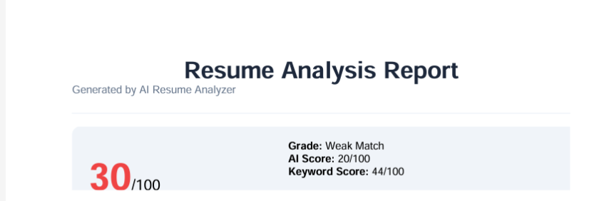

# 🚀 ResumeAI — Advanced AI Career Mastery Platform

ResumeAI is a high-performance career preparation platform designed to help candidates beat the ATS (Applicant Tracking Systems) and master the interview process. Powered by the **Groq AI Engine**, it provides instant semantic analysis, skill gap discovery, and FAANG-level interview coaching.

---

## ✨ Key Features

### 📊 1. AI-Driven Semantic Scoring
Unlike traditional keyword-matching tools, ResumeAI uses advanced Large Language Models (LLMs) to understand the **context and complexity** of your experience.
- **ATS Structural Bonus**: Rewards professional formatting (single column, standard fonts, etc.).
- **Semantic Match**: Analyzes how well your specific achievements align with the job responsibilities.

### 🎯 2. Resume Optimizer & Path to 90
A dedicated suite to help you bridge the gap between your current resume and an elite score.
- **Keyword Injection**: Identifies missing high-impact technical and soft skills.
- **Professional Summary Rewrite**: AI-generated intros tailored to specific roles.
- **Formatting Masterclass**: Built-in guide for MS Word formatting excellence.

### 🎓 3. FAANG-Level Interview Mastery
A comprehensive prep suite that generates **50+ scenario-based questions** based on your resume and target role.
- **Area of Interest Filtering**: Focus your practice on specific domains (e.g., System Design, Leadership).
- **Expert Solutions**: Instant access to high-quality answers and coaching tips.

### 🔊 4. AI Career Coach (Voice Summary)
Get a professional voice-over summary of your analysis, providing verbal recommendations and motivational coaching to prepare you for the role.

---

## 🛠️ Tech Stack

- **Backend**: Python (Flask)
- **AI Engine**: Groq (Llama-3 70B / Mixtral)
- **PDF Engine**: ReportLab (Custom-aligned reports)
- **Frontend**: Vanilla CSS3, JavaScript (ES6+), HTML5
- **Animations**: CSS Keyframes & Intersection Observer API

---

## 🚀 Getting Started

### Prerequisites
- Python 3.8+
- Groq API Key

### Installation

1. **Clone the repository**
   ```bash
   git clone https://github.com/malikmajid161/Resume_analyzer.git
   cd Resume_analyzer/resume_analyzer
   ```

2. **Set up Virtual Environment**
   ```bash
   python -m venv venv
   source venv/bin/activate  # On Windows: venv\Scripts\activate
   ```

3. **Install Dependencies**
   ```bash
   pip install -r requirements.txt
   ```

4. **Configure Environment Variables**
   Create a `.env` file in the root:
   ```env
   GROQ_API_KEY=your_api_key_here
   FLASK_SECRET=your_secret_key
   ```

5. **Run the App**
   ```bash
   python app.py
   ```
   Visit `http://localhost:5000` to start analyzing.

---

## 📸 Screenshots

### Home Page


### Results Dashboard & Path to 90


### FAANG-Level Interview Mastery


### ATS Compatibility Checklist



---

## 🤝 Contributing
Contributions are welcome! Feel free to open issues or submit pull requests to help improve the platform.

## 📄 License
This project is licensed under the MIT License.
