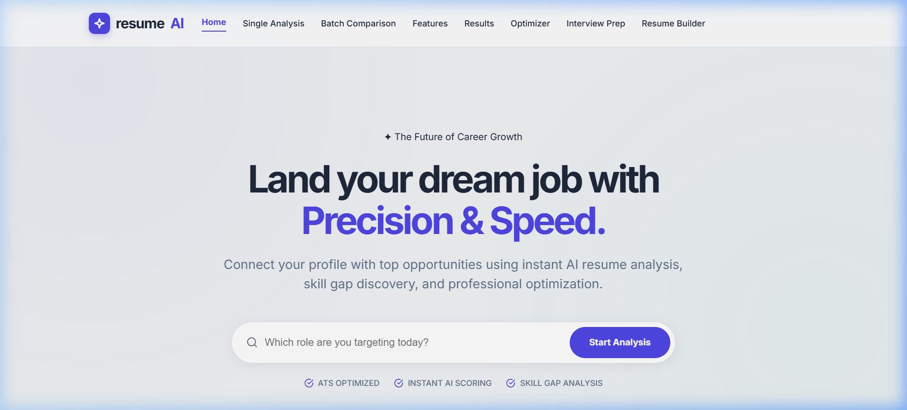
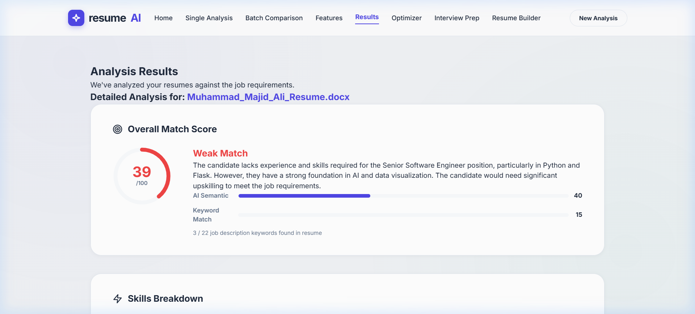
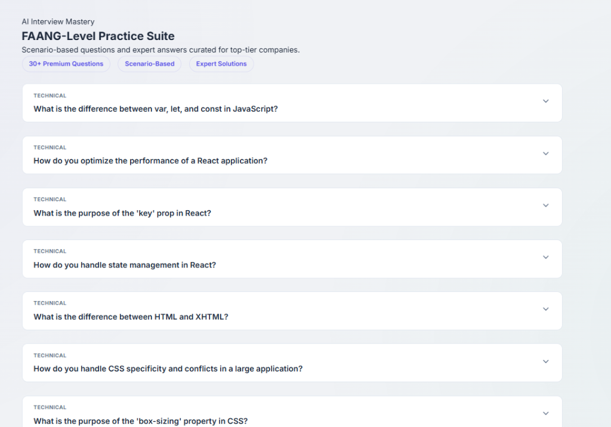

# 🚀 Career Mastery — Advanced AI Career Platform

Career Mastery is a premium, high-performance career preparation platform designed to help candidates beat the ATS (Applicant Tracking Systems) and land their dream jobs. Powered by the **Groq AI Engine**, it provides instant semantic analysis, skill gap discovery, and professional resume building.

**Live Demo**: [https://malikmajid-resume-analyzer.vercel.app/](https://malikmajid-resume-analyzer.vercel.app/)

---

## ✨ Key Features

### 📊 1. AI-Driven Semantic Analysis
Unlike traditional keyword-matching tools, Career Mastery uses advanced Large Language Models (LLMs) to understand the **context and complexity** of your experience.
- **Semantic Match**: Analyzes how well your specific achievements align with the job responsibilities.
- **ATS Structural Validation**: Real-time checks for standard formatting, contact info, and section clarity.
- **Batch Comparison**: Upload multiple resumes to see which version performs best for a specific role.

### ✍️ 2. Professional Resume Builder
A real-time, interactive builder with multiple high-fidelity templates.
- **Modern Layouts**: Choose from Modern ATS, Creative Minimal, Executive Suite, and more.
- **Live Preview**: Watch your resume take shape as you type with instant styling updates.
- **PDF Export**: Generate professional, ready-to-send PDF resumes in seconds.

### 🎓 3. FAANG-Level Interview Mastery
A comprehensive prep suite that generates **50+ scenario-based questions** tailored to your resume and target role.
- **Expert Solutions**: Instant access to high-quality answers and coaching strategies.
- **Focus Areas**: Practice technical deep-dives or behavioral scenario questions.

### 🔊 4. AI Career Coach (Voice Feedback)
Get a professional voice-over summary of your analysis, providing verbal recommendations and motivational coaching to prepare you for the role.

---

## 🛠️ Tech Stack

- **Backend**: Python (Flask)
- **AI Engine**: Groq (Llama-3 / Mixtral) for lightning-fast analysis
- **Voice Engine**: gTTS (Google Text-to-Speech)
- **PDF Engine**: ReportLab (High-fidelity resume generation)
- **Frontend**: Vanilla CSS3 (Glassmorphism), JavaScript (ES6+), HTML5
- **Deployment**: Vercel (Optimized for Serverless /tmp storage)

---

## 🚀 Deployment (Vercel)

This application is optimized for Vercel's serverless environment.

### 1. Environment Variables
You must set the following in your Vercel Dashboard (**Settings > Environment Variables**):
- `GROQ_API_KEY`: Your official Groq API key.
- `FLASK_SECRET`: A secure random string for session encryption.

### 2. Serverless Optimization
The app uses the `/tmp` directory for all file operations (uploads and audio generation), ensuring compatibility with Vercel's read-only file system.

---

## 💻 Local Installation

1. **Clone the repository**
   ```bash
   git clone https://github.com/malikmajid161/Resume_analyzer.git
   cd Resume_analyzer/resume_analyzer
   ```

2. **Set up Virtual Environment**
   ```bash
   python -m venv venv
   source venv/bin/activate  # On Windows: venv\Scripts\activate
   ```

3. **Install Dependencies**
   ```bash
   pip install -r requirements.txt
   ```

4. **Run the App**
   ```bash
   python app.py
   ```
   Visit `http://localhost:5000`.

---

## 📸 Screenshots

### Home & Analyzer


### Results Dashboard


### Interview Mastery


---

## 🤝 Contributing
Contributions are welcome! Feel free to open issues or submit pull requests.

## 📄 License
This project is licensed under the MIT License.
